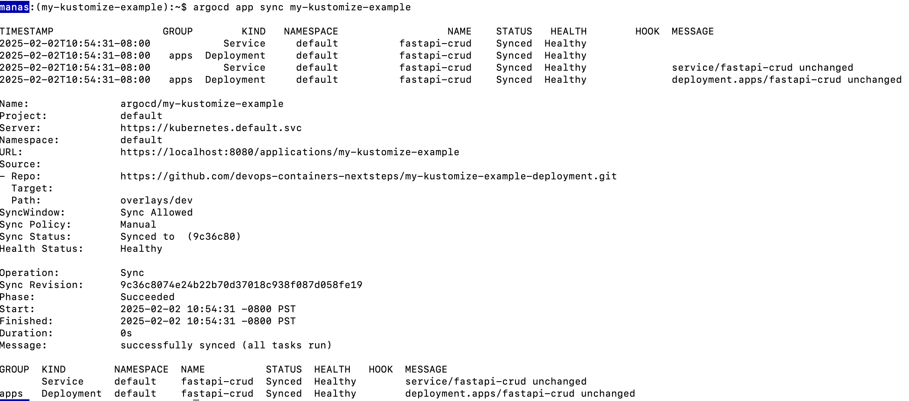
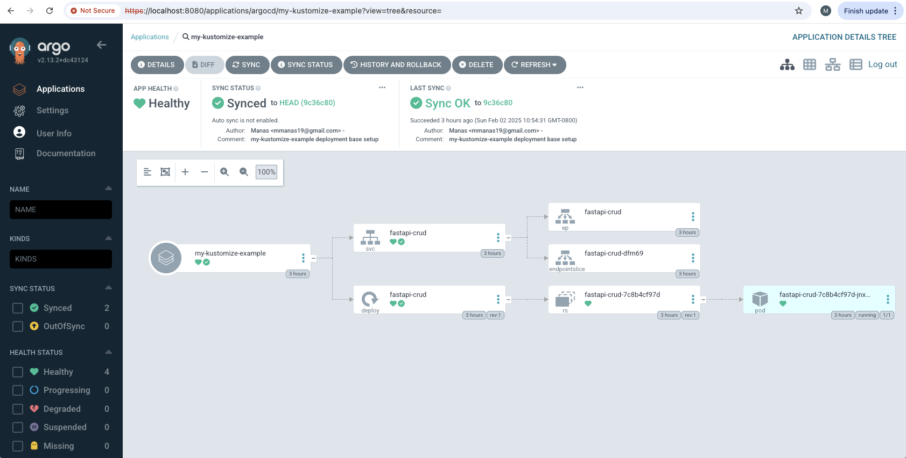

- Feb 2, 2025

# Deploying FastAPI CRUD Application with Argo CD and Kustomize on Minikube

This guide provides step-by-step instructions to deploy a FastAPI-based CRUD application using Argo CD and Kustomize on Minikube. It also includes troubleshooting information for common errors.

## Prerequisites

- macOS with Zsh shell
- Installed Minikube
- Installed kubectl
- Installed Argo CD CLI
- Installed Kustomize
- A GitHub repository containing the Kustomize configuration for deployment

## Step 1: Start Minikube

Start Minikube:

```bash
minikube start
```

Check the status:

```bash
kubectl cluster-info
```

Expected output:

```bash
CoreDNS is running at https://127.0.0.1:57371/api/v1/namespaces/kube-system/services/kube-dns:dns/proxy

To further debug and diagnose cluster problems, use 'kubectl cluster-info dump'.
```

## Step 2: Install and Configure Argo CD

Create the `argocd` namespace:

```bash
kubectl create namespace argocd
```

Install Argo CD:

```bash
kubectl apply -n argocd -f https://raw.githubusercontent.com/argoproj/argo-cd/stable/manifests/install.yaml
```

Expose Argo CD API:

```bash
kubectl port-forward svc/argocd-server -n argocd 8080:443
```

Retrieve the Argo CD admin password:

```bash
kubectl -n argocd get secret argocd-initial-admin-secret -o jsonpath="{.data.password}" | base64 --decode
```

## Step 3: Install Argo CD CLI and Login

Install Argo CD CLI on macOS:

```bash
brew install argocd
```

Login to Argo CD:

```bash
argocd login localhost:8080 --username admin --password $(kubectl -n argocd get secret argocd-initial-admin-secret -o jsonpath="{.data.password}" | base64 --decode) --insecure
```

## Step 4: Register the Minikube Cluster with Argo CD

Check if the cluster is already registered:

```bash
argocd cluster list
```

Expected output:

```bash
SERVER                          NAME        VERSION  STATUS      MESSAGE  PROJECT
https://kubernetes.default.svc  in-cluster  1.31     Successful
```

If the cluster is not listed, register it:

```bash
argocd cluster add minikube
```

Accept the prompt by typing `y`.

## Step 5: Deploy Application Using Argo CD and Kustomize

Create the application in Argo CD:

```bash
argocd app create my-kustomize-example \
  --repo https://github.com/devops-containers-nextsteps/my-kustomize-example-deployment.git \
  --path overlays/dev \
  --dest-server https://kubernetes.default.svc \
  --dest-namespace default
```

Synchronize the application:

```bash
argocd app sync my-kustomize-example
```

Check the application status:

```bash
argocd app get my-kustomize-example
```

## Step 6: Access the FastAPI Application

Get the service details:

```bash
kubectl get svc -n default
```

Expected output:

```bash
NAME           TYPE        CLUSTER-IP      EXTERNAL-IP   PORT(S)   AGE
fastapi-crud   ClusterIP   10.98.157.182   <none>        80/TCP    5m5s
```

Forward the service port to local:

```bash
kubectl port-forward svc/fastapi-crud 8000:80 -n default
```

Test the API:

```bash
curl http://localhost:8000/docs
```

## Step 7: Troubleshooting

### Issue: "Service fastapi-crud does not have a service port 8000"

Fix: Use the correct service port:

```bash
kubectl port-forward svc/fastapi-crud 8000:80 -n default
```

### Issue: "repository not accessible: authentication required"

Fix: Ensure the repository is public or configure repository authentication in Argo CD:

```bash
argocd repo add https://github.com/devops-containers-nextsteps/my-kustomize-example-deployment.git --username YOUR_USERNAME --password YOUR_PERSONAL_ACCESS_TOKEN
```

### Issue: "Cluster 'https://127.0.0.1:' not found"

Fix: Use the correct cluster endpoint:

```bash
argocd cluster add minikube
```

## Step 8: Stopping and Reverting Deployments

### Stopping the Application

```bash
argocd app delete my-kustomize-example
```

### Reverting Deployment Using Kustomize

```bash
kubectl delete -k overlays/dev
```

## Step 9: API Example Requests

### Create an Item

```bash
curl -X 'POST' 'http://localhost:8000/items/' \
     -H 'Content-Type: application/json' \
     -d '{
           "id": 1,
           "name": "Laptop",
           "description": "A high-performance laptop",
           "price": 1200.50,
           "quantity": 10
         }'
```

### Retrieve an Item

```bash
curl -X 'GET' 'http://localhost:8000/items/1' -H 'Content-Type: application/json'
```

## Conclusion

This guide walks through the full setup of deploying a FastAPI CRUD application with Argo CD and Kustomize on Minikube. If you face issues, refer to the troubleshooting section or reach out for help.

🚀 Happy Deploying! 🚀

------------------


## Questions (Debugging & Troubleshooting)

### Questions1 : how to check if the cluster-ip is accessible form my local map ? 
```
$ kubectl get svc -n default 

NAME           TYPE        CLUSTER-IP      EXTERNAL-IP   PORT(S)   AGE
fastapi-crud   ClusterIP   10.11.***.114   <none>        80/TCP    5m5s
```

The ClusterIP (10.11.***.114) is an internal IP inside the Kubernetes cluster, meaning it cannot be accessed directly from your host machine (macOS). However, you can check its accessibility from within the cluster itself.

#### Option 1: Check Access from Inside the Cluster
Since ClusterIP services are only reachable from within the cluster, you need to run a command from a Kubernetes pod:

Start a temporary debugging pod (if you don't already have one):

```
kubectl run curl-pod --image=curlimages/curl -it --rm -- sh
```

Inside the pod, test the connection to the service:
```
curl http://10.11.***.114:80
```

Exit the pod after testing:

```sh
exit
```

If the service is working, you'll see a response from your FastAPI app.

If not, check the FastAPI deployment logs:

```bash
kubectl logs -l app=fastapi-crud -n default
```

#### Option 2: Use Port Forwarding (Access from macOS)
Since ClusterIP is not directly accessible from your Mac, the easiest way to access it is through port forwarding:

```
kubectl port-forward svc/fastapi-crud 8000:80 -n default
```

Now, you can access the API from your host machine (Mac):

```
curl http://localhost:8000
```
or

```
open http://localhost:8000/docs
```

#### Option 3: Change Service Type to NodePort
If you want to access the service without port forwarding, change it to NodePort:

Edit the service:

```
kubectl edit svc fastapi-crud -n default
```

Change this part:

```yaml
spec:
  type: ClusterIP
```

To:

```yaml
spec:
  type: NodePort
```

Save and exit.

Find the assigned NodePort:

```
kubectl get svc fastapi-crud -n default
```

Example output:

```plaintext
NAME           TYPE       CLUSTER-IP      EXTERNAL-IP   PORT(S)         AGE
fastapi-crud   NodePort   10.98.157.182   <none>        80:31234/TCP    5m
```

Here, the NodePort is 31234.

Find the Minikube IP:

```
minikube ip
```

Example output:

```plaintext
192.168.49.2
```

Access from your local machine (Mac):


curl http://192.168.49.2:31234
Or open the API docs:

open http://192.168.49.2:31234/docs

#### Summary

- Directly accessing ClusterIP from macOS? ❌ Not possible.
- Checking from inside the cluster? ✅ Use a temporary pod (kubectl run curl-pod).
- Easiest way to access from Mac? ✅ Use port forwarding (kubectl port-forward).
- Permanent way to expose? ✅ Change service type to NodePort.


### Questions2 : How to solve this ? 

```
$ argocd app create my-kustomize-example \                                                                                               25-02-02 @ 10:46
  --repo https://github.com/devops-containers-nextsteps/my-kustomize-example-deployment.git \
  --path overlays/dev \
  --dest-server https://kubernetes.default.svc \
  --dest-namespace default

FATA[0000] rpc error: code = InvalidArgument desc = application spec for my-kustomize-example is invalid: InvalidSpecError: repository not accessible: repositories not accessible: &Repository{Repo: "https://github.com/devops-containers-nextsteps/my-kustomize-example-deployment.git", Type: "", Name: "", Project: ""}: repo client error while testing repository: rpc error: code = Unknown desc = error testing repository connectivity: authentication required
```

The error message "authentication required" means that Argo CD cannot access your GitHub repository because it is private or requires authentication.

#### Solution: Add Authentication to Argo CD for Private Repositories

- Step 1: Generate a GitHub Personal Access Token (PAT)

Go to GitHub → Settings → Developer settings → Personal access tokens.
Click "Generate new token (classic)".
Select the following scopes:
repo → Full control of private repositories
Click "Generate token", and copy the token.

- Step 2: Add the Repository to Argo CD

```
argocd repo add https://github.com/devops-containers-nextsteps/my-kustomize-example-deployment.git \
  --username YOUR_GITHUB_USERNAME \
  --password YOUR_PERSONAL_ACCESS_TOKEN

```

- Step 3: Verify the Repository
```
argocd repo list
```


## Appendix 

```
argocd repo add https://github.com/devops-containers-nextsteps/my-kustomize-example-deployment.git \
  --username YOUR_GITHUB_USERNAME \
  --password YOUR_PERSONAL_ACCESS_TOKEN
```

A GitHub repository containing the Kustomize configuration for deployment

# my-kustomize-example-deployment

Deployment repo for the my-kustomize-example app in https://github.com/devops-containers-nextsteps/gitops_2025.git

- Docker image: https://hub.docker.com/r/docker4mlops/fastapi-crud
- Deployment repo: [my-kustomize-example-deploymen](https://github.com/devops-containers-nextsteps/my-kustomize-example-deployment)


you can absolutely use Argo CD to deploy your application with Kustomize configurations instead of using kubectl apply -k. Argo CD natively supports Kustomize, so you can manage your Kustomize configurations directly through Argo CD and synchronize them to your Kubernetes cluster.


## Step 1: Create the Application in Argo CD Using Kustomize

When creating an Argo CD application, instead of referencing a direct YAML file or Helm chart, you can specify a Git repository that contains your Kustomize configurations, and Argo CD will automatically apply them.

### 1.1 Create an Application with Argo CD
You can create the application that points to your Kustomize configuration folder (for example, overlays/dev for the development environment).

```python

argocd app create my-kustomize-example \
  --repo https://github.com/devops-containers-nextsteps/my-kustomize-example-deployment.git \
  --path overlays/dev \
  --dest-server https://kubernetes.default.svc \
  --dest-namespace default
```

If it works then, the output should be like this. 

- application 'my-kustomize-example' created


The error message "authentication required" means that Argo CD cannot access your GitHub repository because it is private or requires authentication.

Solution: Add Authentication to Argo CD for Private Repositories
Step 1: Generate a GitHub Personal Access Token (PAT)
Go to GitHub → Settings → Developer settings → Personal access tokens.
Click "Generate new token (classic)".
Select the following scopes:
repo → Full control of private repositories
Click "Generate token", and copy the token.
Step 2: Add the Repository to Argo CD
Now, add your repository with authentication:


argocd repo add https://github.com/devops-containers-nextsteps/my-kustomize-example-deployment.git \
  --username YOUR_GITHUB_USERNAME \
  --password YOUR_PERSONAL_ACCESS_TOKEN
Replace:

YOUR_GITHUB_USERNAME → Your GitHub username.
YOUR_PERSONAL_ACCESS_TOKEN → The token you generated in Step 1.

Step 3: Verify the Repository
Check if Argo CD can now access your repository:

argocd repo list
You should see your repository in the output.

### 1.2 Verify the Application
After creating the application, verify that it was created successfully:

argocd app list
You should see the fastapi-crud app listed.



### ArgoCD UI

Local UI: https://localhost:8080/applications/argocd/my-kustomize-example?view=tree&resource=

